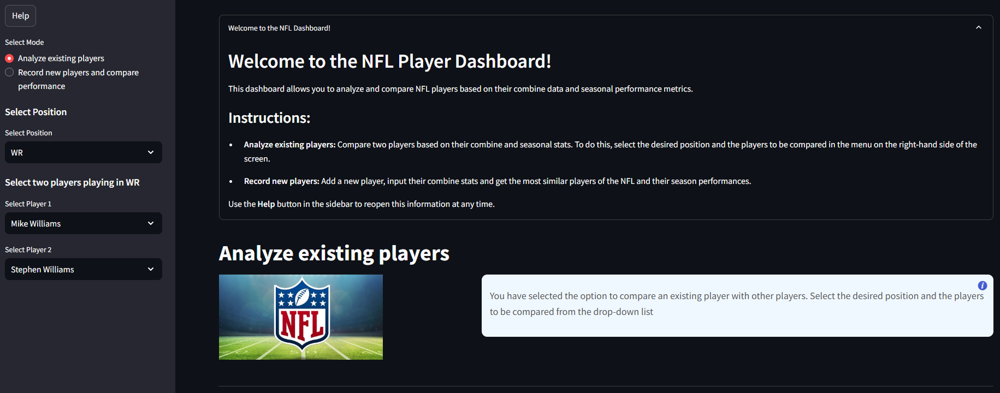
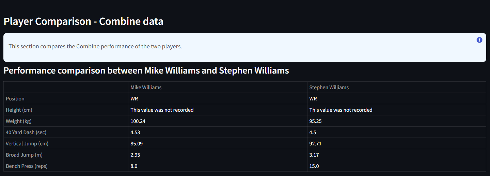
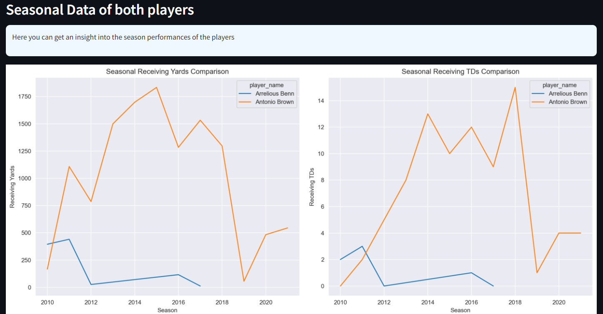
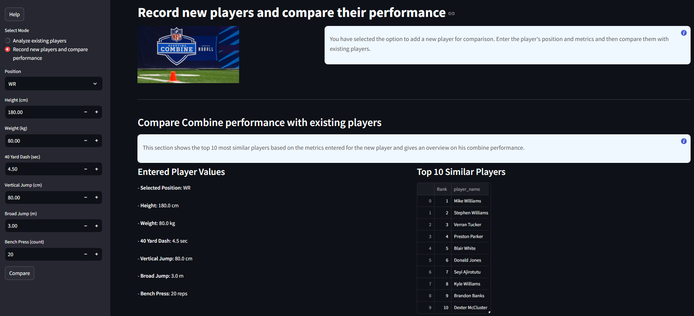
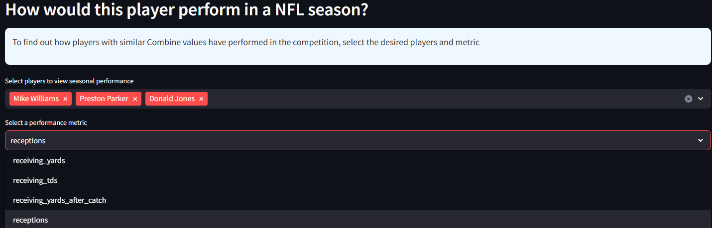
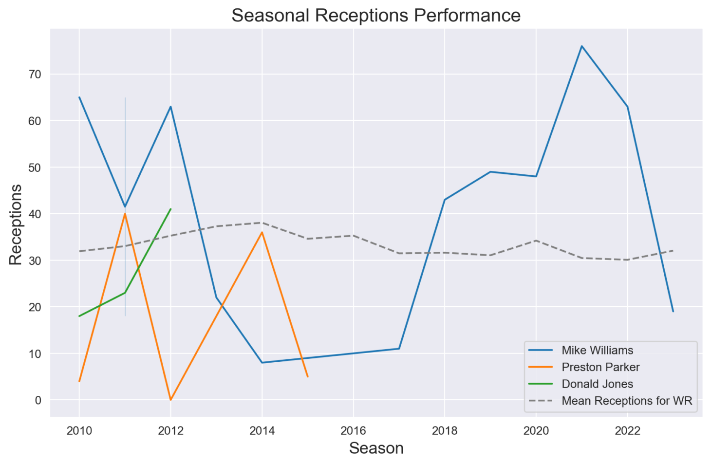

<!-- This Readme file is based on the template found here: https://github.com/othneildrew/Best-README-Template/blob/main/BLANK_README.md  -->

<!-- PROJECT SHIELDS -->
<!-- [![Contributors][contributors-shield]][contributors-url] -->
<!-- [![Stargazers][stars-shield]][stars-url] -->

<!-- PROJECT LOGO -->
 

  

# Combine & seasonal NFL performance data: Do Combine values matter and how strong is their influence on performance in competition?

<!-- TABLE OF CONTENTS -->
<a href="#about-the-project">About The Project</a>
<li><a href="#project-idea">Project Idea</a></li>
<li><a href="#built-with">Built With</a></li>
<li><a href="#data-sources">Data Sources</a></li>
<li><a href="#results">Results</a></li>

# About The Project
The NFL Scouting Combine, also known as the National Invitational Camp (NIC), is a four-day, invitation-only event held annually in Indianapolis. It allows NFL teams to evaluate the top draft-eligible college football players through a series of medical, mental, and physical tests. The Combine is a key step in the player development process, providing teams with standardized, centralized data to aid in draft decisions. Every college player has a dream: to be drafted by an NFL team. Such a draft can secure the future of young athletes and allow them to do what they like best: play football. But the road to becoming a professional is tough and rarely leads past the Combine Event.

# Project idea
This project is intended to provide an insight into the Combine event data and show possible correlations with players' season performances. A dashboard was created for the comparisons between existing players and adding players with new Combine values.

Furthermore, an explorative data analysis was carried out to identify possible correlations in the data and to visualize the results. This serves as a basic understanding for the developed dashboard, which serves as a possible application for sports analysts to carry out quick and uncomplicated analyses.

# Built With

[![Streamlit][streamlit-shield]][streamlit-url]
[![Python][python-shield]][python-url]
[![Matplotlib][matplotlib-shield]][matplotlib-url]
[![Seaborn][seaborn-shield]][seaborn-url]
[![Pandas][pandas-shield]][pandas-url]

# Data Sources
This project utilizes a combination of programmatically imported datasets and expert insights to ensure a comprehensive and accurate analysis of NFL performance data:

**NFL Data**
- Data was retrieved using the [`nfl_data_py`](https://pypi.org/project/nfl-data-py/) library, specifically:
  - `nfl.import_seasonal_data`: Seasonal performance statistics for NFL players.
  - `nfl.import_seasonal_rosters`: Player roster information for NFL seasons.

**Expert Consultation**
- An interview was conducted with a former football coach and football data analyst. This consultation was instrumental in:
  - Identifying key performance measures for Combine and seasonal data.
  - Gaining a deeper understanding of how data analytics can impact player evaluations and performance insights in professional football.

# Results
## Explorative Data Analysis
The analysis aimed to uncover relationships between NFL Combine metrics and seasonal performance. While the data showcased the diversity and depth of NFL statistics, a direct and consistent correlation between Combine performance and seasonal success was not identified.

**Key findings include:**

- Top-performing players at the Combine often stood out during the NFL season, but the influence of Combine metrics on long-term performance was inconclusive.
- The diversity of available data introduces challenges in identifying the most relevant metrics for evaluations.
- A machine learning model was applied to predict player performance based on Combine data but failed to produce reliable results.
- Despite these limitations, the analysis highlighted the potential value of leveraging Combine data for draft decisions. Additional data and a refined approach could yield more actionable insights in the future.

## Streamlit Application:
The dashboard serves as a practical demonstration of how NFL Combine and seasonal performance data can be visualized and analyzed in a user-friendly interface. Built as a prototype for a Business Intelligence (BI) tool, the dashboard allows analysts to explore the data interactively.

**Features include:**

- Player Comparison: Compare Combine and seasonal metrics for different players.
- New Player Input: Record new player metrics and compare them with historical data.
- Visualization and Filtering: Leverage visualizations and filters to gain insights into player performance trends.
- While the current version of the dashboard demonstrates how NFL data can be organized and analyzed, it also highlights the need for more comprehensive datasets to make predictive modeling and draft decisions more reliable.

#### 1. Home
The desired function can be selected in the menu on the start page: Compare Combine Perofmance metrics of existing players or create a new player and compare with similar players and their following season performances.

If a comparison of existing players is selected, the position and the players can be selected

  
View Screenshot

  
  

#### 2. Player stats comparison
This is followed by a comparison of the players' Combine measurement values at the time, which results in a table.

  
View Screenshot

  
  

#### 3. Player seasonal comparison
The seasonal performances are then visualized in time series plots, which consist of:
- receiving yards 
- receiving touchdowns
- receptions
- receiving yards after catch

  
View Screenshot

  
  

#### 4. Record for new player
If the function create a new player and compare with similar players is selected, the input of the measured values of the standardized Combine tests can be entered in the menu and the 10 most similar players who have already played in NFL seasons will result from these values.

  
View Screenshot

  

#### 5. Select players for comparison
Here you can then select the characteristic values for the most similar players and their performance is visualized as a time series plot.

  
View Screenshot

  
  

(<a href="#readme-top">back to top</a>)

<!-- MARKDOWN LINKS & IMAGES -->
[contributors-shield]: https://img.shields.io/github/contributors/Carlomk1/sportsdata_analytics.svg?style=for-the-badge
[contributors-url]: https://github.com/Carlomk1/sports-data-analytics/graphs/contributors
[stars-shield]: https://img.shields.io/github/stars/Carlomk1/sports-data-analytics.svg?style=for-the-badge
[stars-url]: https://github.com/Carlomk1/sports-data-analytics/stargazers
[streamlit-shield]: https://img.shields.io/badge/Streamlit-red.svg?style=for-the-badge
[streamlit-url]: https://streamlit.io/
[python-shield]: https://img.shields.io/badge/Python-3.8+-blue.svg?style=for-the-badge
[python-url]: https://www.python.org/
[matplotlib-shield]: https://img.shields.io/badge/Matplotlib-yellow.svg?style=for-the-badge
[matplotlib-url]: https://matplotlib.org/
[seaborn-shield]: https://img.shields.io/badge/Seaborn-teal.svg?style=for-the-badge
[seaborn-url]: https://seaborn.pydata.org/
[pandas-shield]: https://img.shields.io/badge/Pandas-green.svg?style=for-the-badge
[pandas-url]: https://pandas.pydata.org/